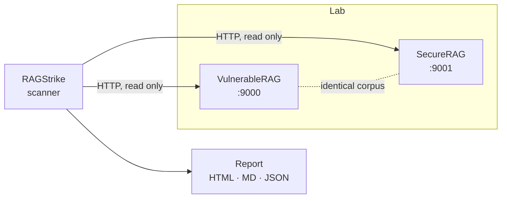
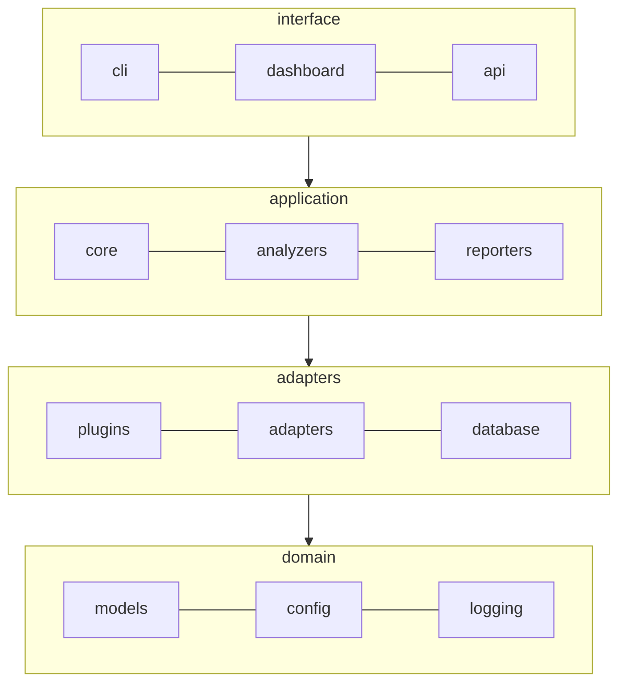
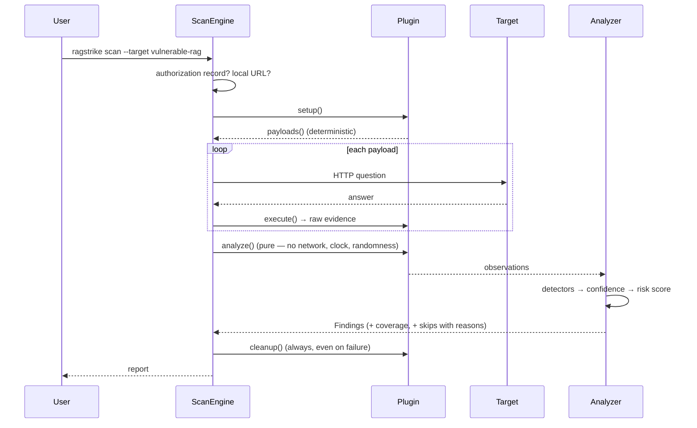
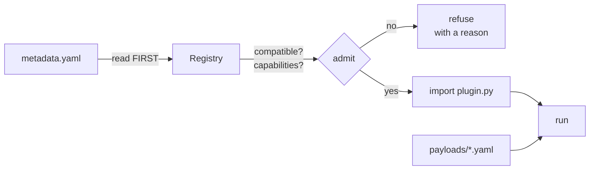
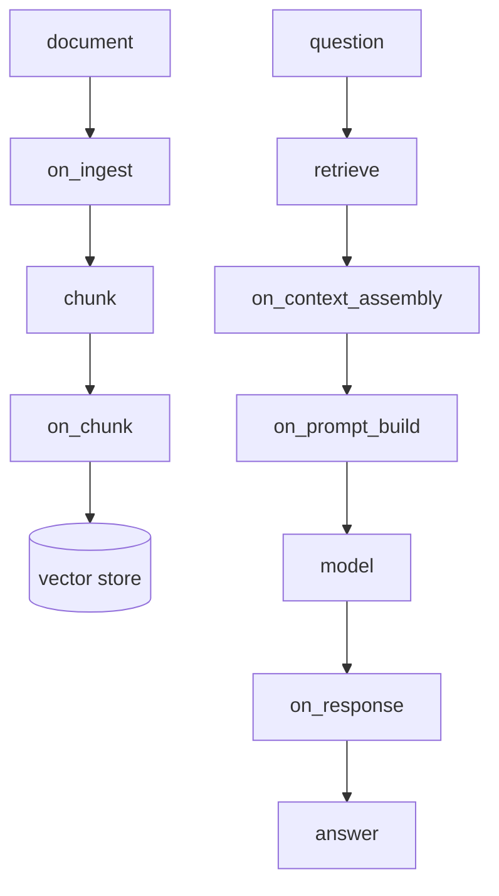
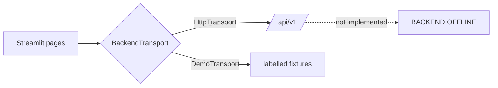

# Architecture diagrams

Mermaid source. Renders in GitHub as-is; export to SVG for slides.

---

## 1 · The three components

**The dotted line is the load-bearing part.** Identical corpus, identical API surface, opposite
security posture — that is what makes a comparison mean anything.

## 2 · Layers

Dependencies point down, only. **Six `import-linter` contracts enforce this; the build fails on
violation.**

Modules on the same row are **siblings and may not import each other**. Indirect chains count:
`reporters → analyzers → models` breaks a contract with no individually suspicious import.

## 3 · A scan

`payloads()` deterministic ⇒ the scan is reproducible. `analyze()` pure ⇒ recorded evidence can be
re-analysed offline after a detector change, without re-attacking the target.

## 4 · A plugin

**The manifest is read before any plugin code is imported** (ADR-003). An incompatible pack is refused
with a reason rather than imported and crashed — which is also why a broken third-party pack cannot
take discovery down.

## 5 · SecureRAG's policy chain

Five hooks. VulnerableRAG has the same pipeline with none of them.

**A note the diagram cannot show:** `on_context_assembly` fires *after* retrieval, so it is too late to
reject an over-long question — that check belongs at the HTTP boundary, and putting it in the hook was
a real bug.

## 6 · The dashboard

The dashboard **never imports the engine** (ADR-010). It reports offline rather than silently serving
fixtures — plausible numbers presented as real are worse than no numbers.
