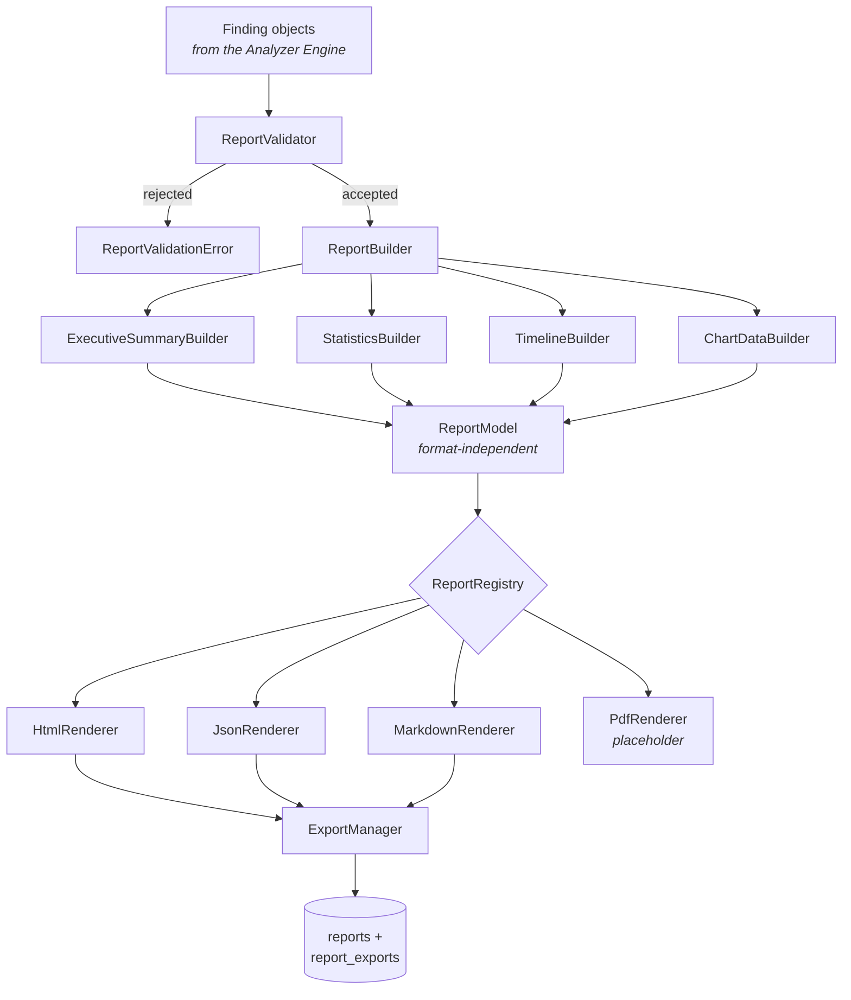
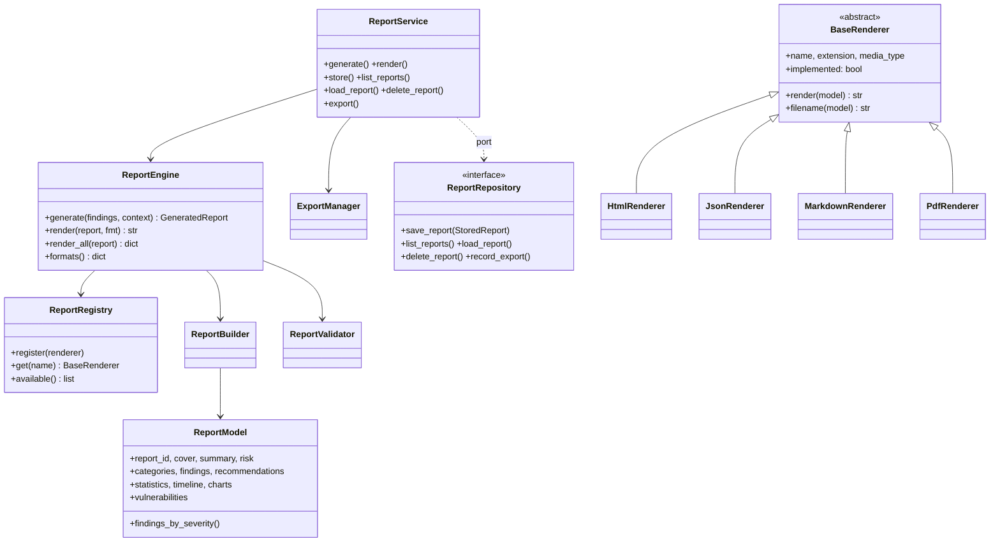
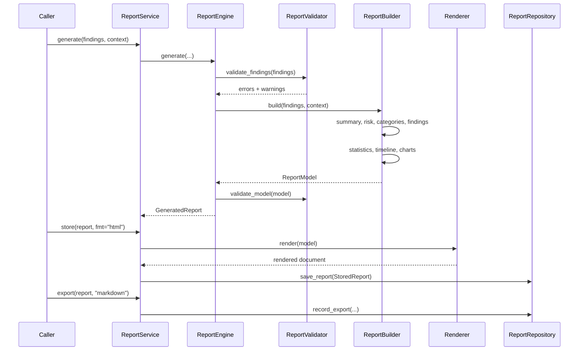

# Reporting Engine

Transforms the standardized `Finding` objects the Analyzer Engine produces into professional
security reports.

**One model, N renderers.** Every computation happens once, in the builders; a renderer only chooses
how to present what it is given. That is what guarantees the HTML, JSON, and Markdown outputs agree
about the same scan, and what makes adding a format a change that touches no arithmetic anywhere.

**It never talks to a plugin, and it never renders a UI.** Its only input is findings.

---

## Architecture



### Class model



### Sequence



---

## Folder responsibilities

```
src/ragstrike/reporters/
├── models/              ReportModel and its ten sections; format-independent
│   └── formatting.py    shared presentation helpers
├── base/                BaseRenderer contract, StoredReport, ports
├── builders/            ReportBuilder + ExecutiveSummaryBuilder
├── statistics/          StatisticsBuilder
├── timeline/            TimelineBuilder
├── charts/              ChartDataBuilder — data, never images
├── validators/          ReportValidator
├── engine/              ReportEngine + ReportRegistry
├── exporters/           ExportManager — the only component that does I/O
├── templates/           TemplateManager + AssetManager
├── html/                HtmlRenderer
├── json/                JsonRenderer
├── markdown/            MarkdownRenderer
├── pdf/                 PdfRenderer (placeholder)
├── service.py           the internal API a Dashboard calls
└── config.py            builds a service from configs/reporting/
```

| Layer | Owns | Does not own |
|---|---|---|
| `models/` | The resolved report shape | Any format decision |
| `builders/` | **Every computation** | How anything is displayed |
| `*/renderer.py` | Presentation in one format | Any arithmetic |
| `engine/` | Format resolution, the unified interface | Any specific format |
| `exporters/` | Writing files | Rendering |
| `service.py` | The five public operations | Storage mechanics |

> **A note on folder naming.** The phase brief names this package `reporting/`. It is built in the
> existing `reporters/` — the Phase 1 scaffold, the name in the layer contract, and the home SDD §19
> designates. Creating a second package alongside it would have left two reporting packages and an
> orphaned scaffold, and "do not rename folders" points the same way. Renderers live in the
> scaffold's existing `html/`, `json/`, `pdf/` directories rather than under a `renderers/` group,
> with `markdown/` added alongside.

---

## The layer position, and why it moved

`reporters` sits on **its own row directly above `analyzers`**, and below `database`.

The Phase 1 contract listed reporters and analyzers as siblings on one row. import-linter treats
same-row modules as *independent* — they may not import each other at all — which was harmless while
both were empty scaffolds and fatal once reporting needed to read `Finding`. The dependency is real
and one-directional: reporting reads findings, and the analyzer must never know a report exists.

Both directions are verified by test:

```python
reporters → analyzers    # allowed
analyzers → reporters    # contract violation
reporters → database     # contract violation
```

**A deferred import is still an import.** The first version of `ReportService.store()` built the
database's record type via an import inside the function, to dodge a module-level dependency.
`lint-imports` caught it — grimp reads the whole AST — and was right to. The fix was structural
rather than a suppression: `StoredReport` is defined in `reporters/base/`, on the lower layer, and
the database maps it onto a row.

---

## Report structure

Ten sections, in order:

| # | Section | Contents |
|---|---|---|
| 1 | Cover | Project, title, organization, versions, scan id, target, timestamp |
| 2 | Executive Summary | Status, risk score, confidence, outcome counts, coverage, duration, headline |
| 3 | Risk Breakdown | Critical / High / Medium / Low / Informational |
| 4 | Category Summary | Score, findings, pass, fail, confidence per category |
| 5 | Detailed Findings | Every field, worst first |
| 6 | Evidence | Carried inside each finding |
| 7 | Recommendations | Grouped by severity, deduplicated |
| 8 | Scan Statistics | Duration, plugin count, averages, versions |
| 9 | Timeline | Chronological events |
| 10 | Chart Data | Six data models — **no images** |

Three decisions worth explaining:

**The risk breakdown counts failures only.** A `PASS` graded INFO is the absence of a finding, not an
informational one; listing it would inflate every report with rows that mean nothing.

**The headline names the coverage gap.** "No failures found" and "no failures found, but a third of
checks reached no verdict" call for different responses, so the summary says which it is.

**`INCONCLUSIVE` outranks `SECURE`.** A run that established nothing must not read as a clean bill of
health — the same rule the analyzer and the packs follow.

---

## Renderer guide

Every renderer implements one method and gets registered:

```python
from ragstrike.reporters.base.renderer import BaseRenderer

class CsvRenderer(BaseRenderer):
    name = "csv"
    extension = "csv"
    media_type = "text/csv"

    def render(self, report) -> str:
        rows = ["plugin,severity,status"]
        rows += [f"{f.plugin},{f.severity},{f.status}" for f in report.findings]
        return "\n".join(rows)

registry.register(CsvRenderer())
```

That is the entire extension path. **Nothing in the engine names a format** — a test parses
`report_engine.py` and asserts no format name appears as a code-level string literal outside the
default-registry helper.

### Rules a renderer follows

**Present, never calculate.** Every number arriving at a renderer was computed once by the builders.
A renderer that recomputed anything would let two formats disagree about the same scan, and the
disagreement would surface as a support question rather than a test failure.

**Escape everything.** A report contains model output, retrieved document text, and prompt
fragments — attacker-influenced by construction. A security tool whose report executes what it found
would be the most embarrassing possible vulnerability, and it is exactly the shape of bug this
codebase detects. `HtmlRenderer` routes every interpolated value through `esc()`.

**Fetch nothing.** Styles are inlined; the only image reference is a configured logo. A report that
phones home when opened is a tracking pixel, whatever it was intended to be.

### The shipped renderers

| Format | Notes |
|---|---|
| `html` | Self-contained document, inlined CSS, light/dark aware, everything escaped |
| `json` | The complete model. The thinnest renderer — the model already serializes itself |
| `markdown` | Survives being pasted into a ticket. Truncates past `max_detailed_findings`, and says so |
| `pdf` | **Declared placeholder.** Raises rather than producing anything |

**The PDF placeholder refuses on purpose.** Emitting an empty file, or HTML with a `.pdf` extension,
would look like success to a caller and fail when someone opens the report — the worst possible time
to find out. `implemented = False` makes the state visible before anyone calls it, and
`render_all()`/`export_all()` skip it, so asking for "everything" does not fail.

---

## Evidence model

Whatever redaction a pack applied is preserved exactly. The reporting engine never reverses it and
never adds any of its own — a pack that redacted did so for a reason it understands better than this
layer does.

```
EvidenceBlock
├── summary       one-line description
├── text          observed response (already redacted by the pack, if it redacts)
├── sources       retrieved or cited sources
├── chunk_ids     retrieved chunk identifiers
├── signals       detector signals — why the finding is believable
├── timing        execution durations
├── structured    everything else, verbatim
└── attachments   reserved — always empty today
```

---

## Charts

**Data models, never images.** Producing pictures here would bind the engine to a plotting library,
make the JSON export carry megabytes of PNG nobody asked for, and force a headless rendering
dependency on a tool that otherwise runs anywhere Python does.

Six models: severity distribution, category distribution, plugin execution time, risk score
distribution, pass vs fail, timeline.

Two choices worth stating: **every severity appears even at zero**, so two scans render with the same
axes; and **risk buckets are fixed**, because a histogram whose bins move with the data cannot be
compared against last month's report — which is most of what a risk chart is for.

---

## Template guide

**Templates are formatted, never evaluated.** Substitution uses `str.Template`, which understands
`$name` and nothing else — no expressions, no attribute traversal, no arbitrary code.

That rules out Jinja despite it already being a dependency. A report template is a file an operator
edits, and a templating language that can execute would turn styling a report into a code-execution
surface for a security tool. Jinja's power is exactly the property this use does not want.

Placeholders in `report.html`:

| Placeholder | Contents |
|---|---|
| `$title` | Report title |
| `$css` | Stylesheet, inlined |
| `$body` | Rendered sections |
| `$footer` | Branding footer |

Drop `report.html`, `report.css`, or `footer.txt` into the configured template directory to override.
Each is optional; the shipped defaults are complete, so a report renders with no customization at
all. `safe_substitute` is used, so a stray `$` in a customized template renders as a literal rather
than losing the whole report.

**Assets are inlined, not linked.** A report is emailed, attached to a ticket, and opened from a
downloads folder six months later. One that depends on a sibling CSS file is broken in all three.

---

## Exporter guide

```python
record = await service.export(report, "markdown", output_dir=Path("reports"))
record.path        # where it went
record.size_bytes  # how big
```

All exporters share one interface, and `export_all()` writes every *available* format.

**Filenames are derived, never taken from input.** A scan id reaches this layer from configuration
and from a database; a report written to `../../etc/something` because an id contained path
separators would be a directory traversal in a security tool. `safe_component()` strips separators,
parent references, and anything unusual, falling back to a safe name when nothing survives.

---

## Persistence

Migration 4 adds two tables:

| Table | Records |
|---|---|
| `reports` | Metadata **and the rendered content** |
| `report_exports` | Append-only log of files written |

**The rendered content is stored, not just the model.** A report is an artifact someone made a
decision from. Regenerating it later would produce a different document the moment a template,
renderer, or report version changed — and "what did the report actually say in March" is exactly
what an audit asks.

A listing never carries content: twenty reports would otherwise mean twenty rendered documents.
Callers that want the content ask for one report by id.

---

## Configuration guide

Three files in `configs/reporting/`:

| File | Controls |
|---|---|
| `reporting.yaml` | Report version, default formats, output directory, strict validation, truncation limit |
| `branding.yaml` | Title, organization, logo, theme, footer |
| `templates.yaml` | Template directory, asset inlining |

```python
from ragstrike.reporters.config import build_service

service, config, report = build_service(repository=repo)
if not report.fully_configured:
    print(report.missing)

generated = service.generate(findings, config.context(scan_id=scan_id, target=url))
```

`config.context(...)` pre-fills branding, so title, organization, and logo do not have to be copied
into place by every caller — which is how those three drift apart between the HTML and JSON of the
same scan.

**Every loader falls back to built-in defaults and reports what fell back.** A tool that refuses to
produce a report because one YAML file has a typo is one that does not get used; one that silently
ignores the branding an operator just configured is worse.

---

## The internal API

Five operations, for the future Dashboard:

```python
service.generate(findings, context)      # -> GeneratedReport, touches nothing
service.render(report, "html")           # -> str
await service.store(report, fmt="html")  # -> report_id
await service.list_reports(scan_id)      # -> list[ReportSummary]
await service.load_report(report_id)     # -> str | None
await service.delete_report(report_id)   # -> bool
await service.export(report, "markdown") # -> ExportRecord
```

A caller uses these without knowing that renderers exist, that a registry resolves them, or that
reports live in SQLite.

**Generating is separate from persisting.** `generate()` touches no storage and no filesystem, so
previewing a report does not require cleaning up afterwards. `export()` works with no repository at
all — exporting to a file in a CI job with no database is the simplest case, and requiring storage
for it would make it the hardest.

`delete_report()` returns whether anything was removed, so a caller can distinguish "removed" from
"was never there"; reporting success for a no-op would hide a wrong id.

---

## Developer guide

The whole pipeline, from a stored scan:

```python
from ragstrike.analyzers.base.observation import Observation
from ragstrike.analyzers.config import build_engine as build_analyzer
from ragstrike.reporters.config import build_service
from ragstrike.database.repositories.report_repository import ReportRepository

results = await ScanRepository(db).results_for(scan_id)
analyzer, _ = build_analyzer()
analysis = analyzer.analyze(
    [Observation.from_plugin_result(r, category=category_of(r)) for r in results],
    scan_id=scan_id,
)

service, config, _ = build_service(repository=ReportRepository(db))
report = service.generate(list(analysis.findings), config.context(scan_id=scan_id, target=url))
await service.store(report, fmt="html")
```

Testing needs no database, no config tree, and no filesystem — `ReportEngine()` works with built-in
defaults and every builder is pure:

```python
model = ReportBuilder().build(findings, ReportContext(scan_id="s1"))
assert model.summary.status == "VULNERABLE"
```

**Put computation in a builder, never in a renderer.** If two formats would need the same number,
that number belongs in the model.

**Escape in the renderer, not in the builder.** The model holds raw values; escaping is a
format-specific decision, and pre-escaped HTML entities in a JSON export would be wrong.

---

## Extension guide

**Add a format** — subclass `BaseRenderer`, implement `render`, register it. No existing code
changes.

**Add a report section** — add a dataclass to `models/report.py`, populate it in `ReportBuilder`,
render it in each renderer. The model change is the contract; renderers that ignore it still work.

**Add a chart** — add a method to `ChartDataBuilder` and include it in `build_all`.

**Customize appearance** — `configs/reporting/branding.yaml`, or drop templates into the configured
directory. No code.

**Persist somewhere else** — implement the `ReportRepository` protocol. The service takes it as a
parameter, so nothing else changes.

---

## Known limits, stated plainly

- **PDF is a placeholder.** It refuses rather than producing anything. Implementing it means giving
  the class a real `render` and flipping `implemented`; nothing else in the engine changes.
- **No CLI command yet.** The engine is a library. Wiring `ragstrike report` was not in this phase's
  scope.
- **Category must be supplied to the analyzer.** `PluginResult` does not record it, so a report's
  category summary is only as good as what the caller passed to `Observation.from_plugin_result`.
- **Markdown truncates past 50 findings** by default. The count omitted is always stated, and the
  JSON export always carries all of them.
- **Charts are data only.** Rendering them as pictures is a consumer's job.

---

## Where things live

| Concern | Path |
|---|---|
| The engine | `src/ragstrike/reporters/` |
| Report model | `.../models/report.py` |
| Builders | `.../builders/`, `.../statistics/`, `.../timeline/`, `.../charts/` |
| Renderers | `.../html/`, `.../json/`, `.../markdown/`, `.../pdf/` |
| The internal API | `.../service.py` |
| Persistence | `src/ragstrike/database/repositories/report_repository.py` |
| Configuration | `configs/reporting/` |
| Tests | `tests/unit/test_reporting_*.py`, `tests/integration/test_reporting_integration.py` |
| Upstream | [`docs/analyzer-engine.md`](analyzer-engine.md) |
