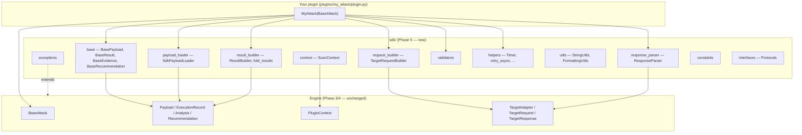
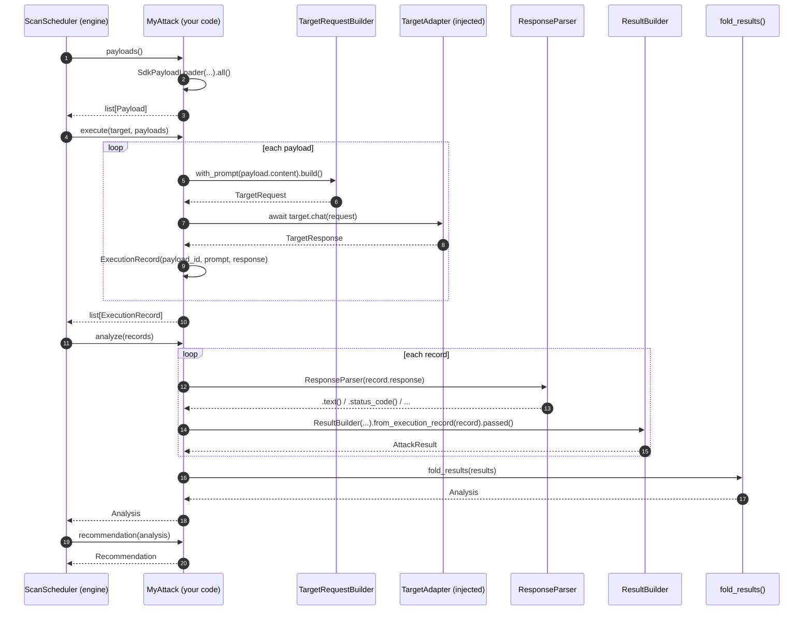

# SDK Guide

The Attack SDK is what turns *"we have a plugin contract"* into *"a real attack is under 100
lines."* This guide covers what the SDK is for, how its pieces fit together, and how to write an
attack using it. For the plugin lifecycle itself (validate → healthcheck → setup → payloads →
execute → analyze → cleanup) see [`plugin-development.md`](plugin-development.md) and
[`plugin-lifecycle.md`](plugin-lifecycle.md) — this guide assumes you have read the first of those
and covers what sits *inside* `execute()`/`analyze()`, not the contract around them.

---

## Why the SDK exists

`BaseAttack` (Phase 3/4) fixes the contract: five required methods, a handful of optional
lifecycle hooks, dependency injection via `PluginContext`. It does not, and should not, fix *how*
a plugin builds a request, reads a response, or tracks per-payload outcomes on the way to a
verdict — that is exactly the code every plugin would otherwise duplicate. The SDK is that code,
written once.

Think Nmap NSE's Lua API, or Burp's extension SDK, or pytest's fixture and assertion machinery:
the framework provides the plumbing, the plugin author provides the technique.

## What changes, what doesn't

**Nothing about the Phase 3/4 contract changes.** `BaseAttack` still has the same five required
methods and the same optional hooks. `Payload`, `ExecutionRecord`, `Analysis`, `Recommendation`
are still exactly what the scheduler expects. `PluginContext` is still the one way a plugin
receives configuration.

**What the SDK adds is everything that used to be duplicated per plugin:** building a
`TargetRequest`, extracting facts from a `TargetResponse`, tracking one result per payload before
folding them into the `Analysis` the engine actually reads, and the small validation/formatting/
retry helpers every plugin eventually needs.

---

## Dependency diagram



**The arrow direction is the whole point.** The SDK depends on the engine; nothing in the engine
depends on the SDK. `.importlinter` enforces this: `ragstrike.sdk` sits directly above
`ragstrike.plugins` in the layer stack, so it may import `plugins.base` (for `Payload`,
`Recommendation`, `PluginContext`) and everything below, but nothing in `core/`, `scheduler/`,
`plugins/registry/`, or `plugins/loader/` may import the SDK.

---

## Class diagram — the SDK's own types

```mermaid
classDiagram
    class BaseAttack {
        <<engine, Phase 3/4>>
        +metadata() AttackMetadata
        +payloads() list~Payload~
        +execute(target, payloads) list~ExecutionRecord~
        +analyze(records) Analysis
        +recommendation(analysis) Recommendation
    }

    class TargetRequestBuilder {
        +with_prompt(str) Self
        +with_session(str) Self
        +with_timeout(int) Self
        +with_header(str, str) Self
        +build() TargetRequest
    }

    class ResponseParser {
        +text() str
        +json() Any
        +chunks() list
        +sources() list
        +citations() list
        +status_code() int
        +headers() dict
        +ok() bool
    }

    class AttackResult {
        +plugin_name str
        +payload_id str
        +payload str
        +target str
        +start_time datetime
        +end_time datetime
        +status PluginOutcome
        +evidence dict
        +severity Severity
        +confidence float
        +recommendation Recommendation
        +references tuple
        +notes str
        +duration_ms int
    }

    class ResultBuilder {
        +for_payload(id, payload) Self
        +from_execution_record(record) Self
        +passed() Self
        +failed() Self
        +with_severity(Severity) Self
        +build() AttackResult
    }

    class SdkPayloadLoader {
        +load() LoadResult
        +all() list~Payload~
    }

    class ScanContext {
        +configuration dict
        +logger Logger
        +target TargetAdapter
        +database Any
        +current_plugin str
        +scan_id str
        +from_plugin_context(ctx, target) ScanContext$
    }

    BaseAttack ..> TargetRequestBuilder : uses in execute()
    BaseAttack ..> ResponseParser : uses in analyze()
    BaseAttack ..> ResultBuilder : uses in analyze()
    BaseAttack ..> SdkPayloadLoader : uses in payloads()
    BaseAttack ..> ScanContext : optionally assembles in execute()
    ResultBuilder --> AttackResult : builds
    ResultBuilder ..> "fold_results()" : many AttackResult -> one Analysis
```

---

## Sequence diagram — one payload, start to finish



---

## Writing an attack: the three things you actually write

### 1. Metadata

Class attributes on your `BaseAttack` subclass — no `metadata()` override needed:

```python
class MyAttack(BaseAttack):
    plugin_id = "my-attack"
    plugin_name = "My Attack"
    plugin_version = "1.0.0"
    category = "prompt_injection"
    severity = Severity.HIGH
    requires_capabilities = (Capability.CHAT,)
```

### 2. Payloads

From disk, via the lenient loader:

```python
def payloads(self) -> list[Payload]:
    return SdkPayloadLoader(self.context.payload_dir).all()
```

Or generated in code — still must be deterministic (same options → same payloads, same order).

### 3. A success criterion

This is `analyze()`. Use `ResponseParser` to read what came back, `ResultBuilder` to record the
verdict per payload, `fold_results()` to produce the `Analysis` the engine requires:

```python
def analyze(self, records: list[ExecutionRecord]) -> Analysis:
    results = []
    for record in records:
        text = ResponseParser(record.response).text()
        builder = ResultBuilder(plugin_name=self.plugin_name, target="t").from_execution_record(record)
        # Your success criterion goes here:
        outcome = builder.failed() if "CANARY-TOKEN" in text else builder.passed()
        results.append(outcome.build())
    return fold_results(results)
```

Everything else — request plumbing, response field access, per-payload timing, folding into the
engine's aggregate verdict — already exists.

---

## Validation and errors

Use `sdk.validators` for the boring, attack-agnostic checks before your success criterion even
runs:

```python
from ragstrike.sdk import validators

def analyze(self, records):
    for record in records:
        if not validators.response_has_text(record.response):
            continue  # nothing to judge
        ...
```

Use `sdk.exceptions` when something needs to fail loudly. Every SDK exception `isinstance`-checks
true against the matching `ragstrike.core.errors` type, so the scheduler's isolation guard and the
CLI's exit-code mapping both keep working without knowing the SDK exists:

```python
from ragstrike.sdk.exceptions import PluginConfigurationError

def validate(self) -> ValidationReport:
    if "threshold" not in self.context.config:
        raise PluginConfigurationError("threshold is required")
    return super().validate()
```

---

## Coding standards for SDK-based plugins

- **`execute()` is the only place with I/O.** Build requests, call `target.chat()`, done. No
  parsing decisions, no verdicts.
- **`analyze()` is pure.** No network, no clock, no randomness — call `ResponseParser` and
  `ResultBuilder` freely (both are pure over their inputs), but never `await` anything here.
- **Retries wrap exceptions, not responses.** `retry_async` retries transport failures. A response
  that came back — even a refusal — is data for `analyze()`, never a reason to resend the payload.
  Resending would silently inflate `attempts` and corrupt the exploitability measurement.
- **Payloads are deterministic.** Same options, same payloads, same order, every run.
- **Recommendations come from your own logic, not runtime generation.** Branch on
  `analysis.outcome` if your advice should vary; otherwise a fixed `Recommendation` is fine (see
  `examples/custom_pack/plugin.py`).
- **Keep it short.** If your `plugin.py` is pushing past 150 lines, some of it is probably request/
  response plumbing that belongs in a helper the SDK already provides — check before writing a new
  one.

---

## Worked example

`examples/custom_pack/plugin.py` is the complete reference: 99 lines, uses every major SDK piece
(`SdkPayloadLoader`, `TargetRequestBuilder`, `ResponseParser`, `ResultBuilder`, `fold_results`),
sends one benign question, and asserts nothing about security. It is not discovered by the plugin
registry — it lives under `examples/`, not `plugins/` or `packs/` — so run it directly in a test
or read it as a template.

For the reference plugin that *is* discovered (and exercises the full lifecycle including
`setup`/`healthcheck`/`cleanup`), see `plugins/dummy_attack/`.
